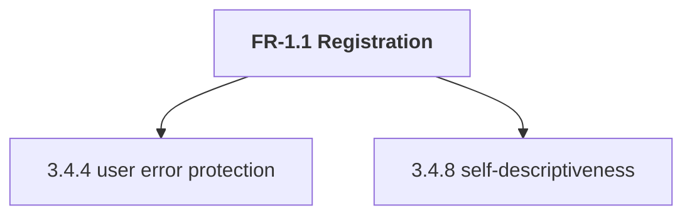
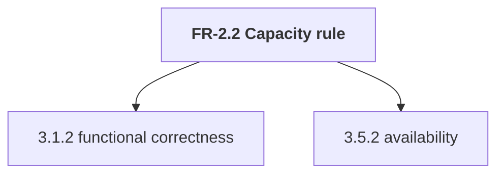
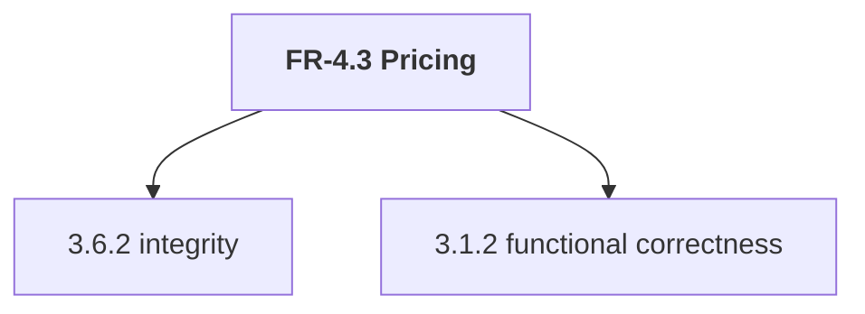

# Lab Reflection — WalkMates

**Lab:** 1

**Pair:** Carl Jonsson & Adam Persson

**Repo:** [GitHub Repo](https://github.com/Calle-J/walkmates-cajo2406)

---

### 1. What we did
The laboration was divided into two parts, and both were documented in [lab1-analysis.md](../lab1-analysis.md). We 
started **part A** by selecting three features and performed quality-attribute analysis on them. The next thing we did 
was to connect these features to two ISO/IEC 25010 quality characteristics each, most at stake, which resulted in:







Once the quality-attribute analysis was done, we did a bug analysis. The goal was to trace the chain
and identify the human error, the fault in the code, and lastly, the failure the user saw. Our bug analysis revealed
that a human error was causing the bug we found, which typically should be caught at the unit level.

**Part B** of the laboration consisted of three different activities. We started with a **``Equivalence Partitioning``**
with focus on valid/invalid classes for email, display name, phone number, and wallet top-up amount. The next thing 
we did was the **``Boundary Value Analysis``** with focus on wallet boundaries to identify potential issues 
related to wallet top-up limits. Lastly, we did the **``Decision table``** to verify that each trust tier was 
mapped to the correct limits (max concurrent bookings and platform fees). We created tables for all three activities
and then tests related to every entry in each table.

### 2. What we found
The bug analysis revealed that the booking-limit check used the wrong comparison operator:
``` java
if (seekerActive > seeker.getMaxConcurrentBookings()) { ... }
```

it should have been like this:
``` java
if (seekerActive >= seeker.getMaxConcurrentBookings()) { ... }
```

The human error was choosing the wrong comparison operator. The fault was the incorrect condition in the code,
and the failure was that a seeker could take on more bookings than allowed.

Our specification-based tests also exposed a fault in the international phone-number validation. The regular expression
accepted an international number that was one digit too short.
  
The pattern looked like this:
```java
 private static final Pattern PHONE = Pattern.compile("^(07\\d{8}|\\+467\\d{7})$");
```

when it should have been like this:
```java
 private static final Pattern PHONE = Pattern.compile("^(07\\d{8}|\\+467\\d{8})$");
```

### 3. AI use
We created the analysis tables ourselves and used AI mainly to generate test methods for the 
**``Equivalence Partitioning``** and **``Boundary Value Analysis``** tables.

We reviewed the generated tests against the requirements, our tables, and the **``Seeker``** implementation. Most of
the suggestions were useful, but we changed the maximum-wallet-balance test. The original version first created a
balance of 20,000 SEK and then attempted to add 10 SEK. We changed it to create a balance of 19,991 SEK and then add
10 SEK, resulting in a balance of 20 001 SEK. This tests the "just above the maximum balance" case more directly.

AI helped with the test-code generation, but we were responsible for deciding which partitions and boundary values
were relevant and whether the tests matched the intended specification.

### 4. Judgment
We decided to add equivalence classes manually, although it could have been done by generative AI. We came to the 
conclusion that using generative AI for this task would not vastly contribute to increased effectiveness. 
This is because of the time we would have spent reviewing the output to ensure the classes align with our requirements. 

Throughout the laboration, we used generative AI as a tool for *effectiveness*, and not for *decision-making*, in order
to maintain control over our testing and ensure quality. 

### 5. What we'd test next
Next, we would continue to test core functionality, prioritizing the booking functionality. 
We would specifically focus on the combined booking-creation rule in **``FR-4.4``**, because of its complexity
in combining listing availability, capacity limits, duration, and wallet balance. 
---
