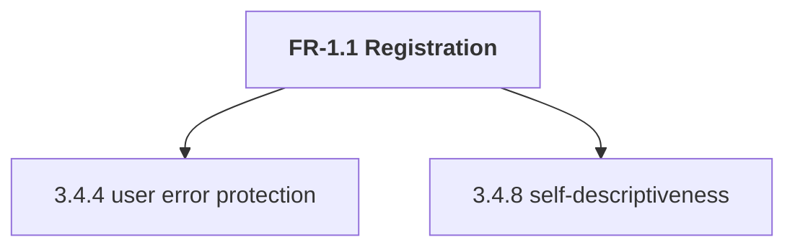
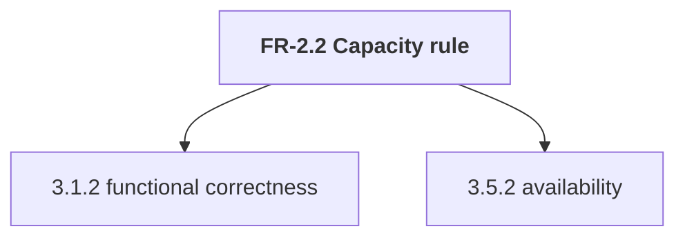
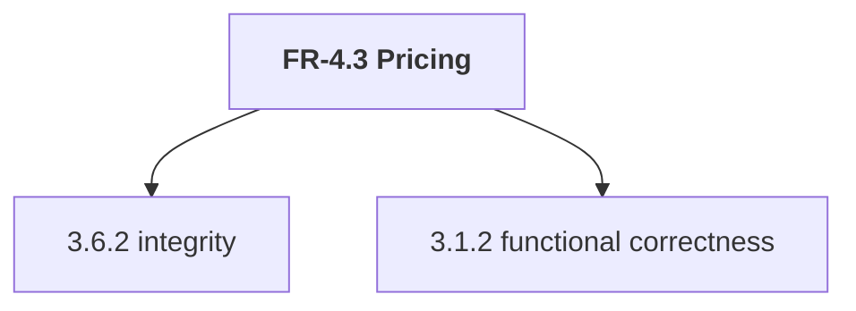

# Lab Reflection — WalkMates

> One per lab. Keep it **short and specific** — this is graded for *understanding*, not length.
> Half a page to a page is plenty. Bullet points are fine.
>
> **Before writing:** copy this file to `reflections/labN-reflection.md`, replacing `N` with the
> lab number. Keep this template unchanged so it remains available for the next lab.

**Lab:** 1

**Pair:** Carl Jonsson & Adam Persson

**Repo commit/tag:** [GitHub Repo](https://github.com/Calle-J/walkmates-cajo2406)

---

### 1. What we did
The laboration was divided into two parts, we started part A by selecting three features and performed
quality-attribute analysis on them. The next thing we did was to connect these features to two ISO/IEC 25010
quality characteristics each, most at stake, which resulted in:





Once the quality-attribute analysis was done, the next thing we did was a bug analysis. The goal was to trace the chain
and identify the human error, the fault in the code, and lastly, the failure the user saw. Our bug analysis revealed
that a human error was the cause of the bug we found, which typically should be caught at the unit level.

Part B of the laboration consisted of three different moments. We started with a **``Equivalence Partitioning``**
with focus on valid/invalid classes for email, display name, phone number, and wallet top-up amount. This was done in
a table format. The next thing we did was the **``Boundary Value Analysis``** with focus on wallet boundaries to 
identify potential issues related to wallet top-up limits. Lastly, we did the **``Decision table``** to verify that each 
trust tier was mapped to the correct limits (max concurrent bookings and platform fees).

### 2. What we found
We found a logic mistake during our bug analysis where the fault was the usage of the wrong operator. This resulted
in a failure where a seeker was able to take on more bookings than allowed.

The code with the bug looked like this:
``` java
if (seekerActive > seeker.getMaxConcurrentBookings()) { ... }
```
when it should have been like this:
``` java
if (seekerActive >= seeker.getMaxConcurrentBookings()) { ... }
```

We also found an error in **``Seeker.java``** where the format for the international phone number was too short.  
The format looked like this. 
```java
 private static final Pattern PHONE = Pattern.compile("^(07\\d{8}|\\+467\\d{7})$");
```
when it should have been like this:
```java
 private static final Pattern PHONE = Pattern.compile("^(07\\d{8}|\\+467\\d{8})$");
```

### 3. AI use
We used AI to generate the different tests connected to the tables in [`lab1-analysis.md`](../lab1-analysis.md).
We created all the tables ourselves, and AI helped us to generate the tests for the 
**``Equivalence Partitioning``** and the **``Boundary Value Analysis``** tables. 

After the tests were generated, we reviewed them thoroughly to ensure that they were accurate and complete. The tests
were accurate overall with just some minor adjustments, and nothing felt wrong or weak.

One of the tests required some adjustments to fit in with our initial plan regarding the **``wallet top-up amount``**.

AI gave us this:
```java
@Test
    @DisplayName("Wallet top-up that would exceed 20000.00 SEK balance is rejected")
    void walletTopUpExceedingMaxBalanceIsRejected() {
        Seeker seeker = new Seeker("adam@example.com", "Adam", "0731231234");
        seeker.addFunds(5000.00);
        seeker.addFunds(5000.00);
        seeker.addFunds(5000.00);
        seeker.addFunds(5000.00); // Balance: 20 000.00
        assertThrows(IllegalArgumentException.class,
                () -> seeker.addFunds(10.00)); // Would make 20 010.00
    }
```

But the final test to match the intended result was:
```java
@Test
    @DisplayName("Wallet top-up that would exceed 20000.00 SEK balance is rejected")
    void walletTopUpExceedingMaxBalanceIsRejected() {
        Seeker seeker = new Seeker("adam@example.com", "Adam", "0731231234");
        seeker.addFunds(5000.00);
        seeker.addFunds(5000.00);
        seeker.addFunds(5000.00);
        seeker.addFunds(4991.00); // Balance: 19 991.00
        assertThrows(IllegalArgumentException.class,
                () -> seeker.addFunds(10.00)); // Would make 20 001.00
    }
```

### 4. Judgment
Where did *you* have to decide something the tools/AI couldn't decide for you? (e.g. which
equivalence classes matter, whether coverage was "enough", whether a mutant was equivalent.)

### 5. What we'd test next
If you had another hour, what's the next test or risk you'd go after?

---